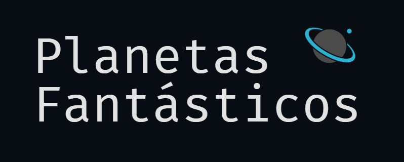
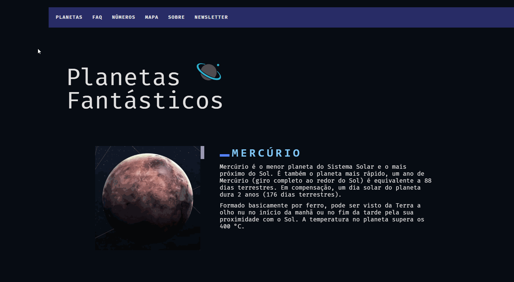

<h1 align="center">
  
</h1>

---

<p align="center">
  
  
  
</p>

_<p align="center">* Status: Em andamento 🚧 </p>_

---

<p align="center">
 <a href="#sobre-o-projeto">Sobre</a> •
 <a href="#demonstração">Demonstração</a> • 
 <a href="#tecnologias-utilizadas">Tecnologias</a> • 
 <a href="#funcionalidades">Funcionalidades</a> • 
  <a href="#dependências">Dependências</a> • 
 <a href="#como-executar-o-projeto">Como executar</a> • 
 <a href="#licença">Licença</a> 
</p>

---

## 📑 Sobre o projeto
Planetas Fantásticos é uma página web para demonstração dos Planetas do Sistema Solar :ringed_planet:, contendo  dados, informações e imagens sobre os mesmos. Foi construído com base no projeto codificado durante o curso de [Javascript Completo ES6+, da Origamid](https://www.origamid.com/curso/javascript-completo-es6/), sendo feitos alguns ajustes em relação ao original, porém mantendo a mesma estrutura de código.
Neste projeto, foram utilizados os principais tópicos de programação front-end com Javascript, como: conceitos e efeitos de DOM; responsividade; objetos; JS assíncrono; classes; regexp; modules; dentre outros...

---

## 🎨 Demonstração

<div align="center">
  
</div>

---

## 🚀 Tecnologias utilizadas
As seguintes ferramentas foram utilizadas no desenvolvimento do projeto:
- [**HTML**](https://html.com/)
- [**CSS**](https://www.w3.org/Style/CSS/)
- [**Javascript**](javascript.com)
- [**NodeJS**](https://nodejs.org/en/)
- [**Visual Studio Code**](https://code.visualstudio.com/)

---

## 📌 Funcionalidades
- [x] Navegação por Tabs
- [x] Accordion List
- [x] Animação de scroll / Scroll suave
- [x] Modal
- [x] Tooltip
- [x] Menu dropdown
- [x] Menu mobile
- [x] Animação de números
- [x] Fetch API
- [ ] Slides

---

## 🧲 Dependências
- [x] **[ESLint](https://eslint.org/)**
- [x] **[Webpack](https://webpack.js.org/)**
- [x] **[Babel](https://babeljs.io/)**

---

## 🛠️ Como executar o projeto

#### Pré-requisitos

Além de um <u>navegador de internet atualizado</u>, você precisa ter instalado em sua máquina as seguintes ferramentas: [Git](https://git-scm.com), [Node.js](https://nodejs.org/en/) e um editor de código como [VSCode](https://code.visualstudio.com/). Então, siga as instruções abaixo:
``` bash
# Clone este repositório:
$ git clone https://github.com/leonarclo/planetas-fantasticos.git

# Entre no diretório:
$ cd planetas-fantasticos

# Visualizaçao:
$ npx liver-server

```
---

## 📝 Licença
Este projeto está licenciado sob a licença MIT. Para mais detalhes, acesse o arquivo [LICENSE.md](https://github.com/leonarclo/planetas-fantasticos/blob/main/LICENSE).

